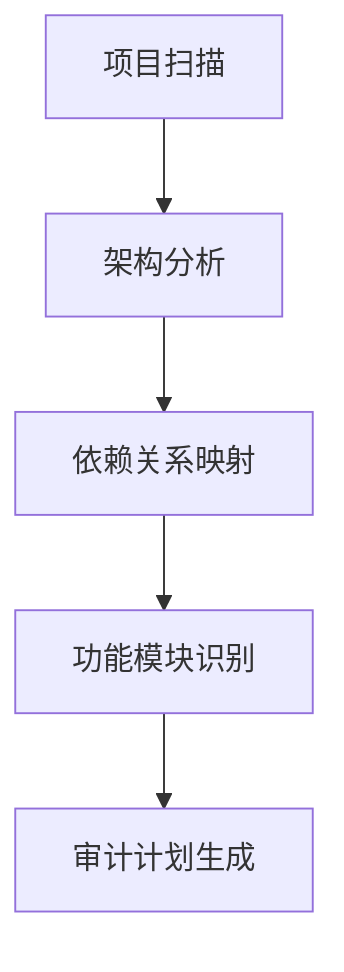
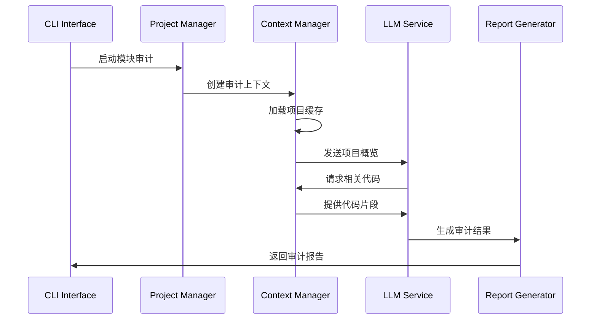

# AI代码审计系统 - 全新版本实施方案

## 项目概述

基于LLM的智能代码审计系统，采用CLI命令行界面，支持项目级别的深度代码安全审计。系统采用分段式审计策略，让AI在理解整体项目架构的基础上，针对特定功能模块进行深度审计。

## 核心设计理念

### 1. 分段式审计策略
- **项目全局理解**: AI首先理解整个项目的架构和结构
- **功能模块分离**: 将项目按功能模块划分，每个模块独立审计
- **上下文隔离**: 每个功能模块使用独立的对话上下文
- **主动代码检索**: AI根据审计需求主动请求相关代码文件

### 2. 智能上下文管理
- **项目缓存机制**: 缓存项目基础信息，便于跨会话复用
- **动态代码加载**: 根据审计需求动态加载相关代码片段
- **关联性分析**: 自动识别代码间的依赖关系和调用链

### 3. 核心处理机制
- **会话隔离**: 每个功能点一条独立上下文线，避免信息污染；共享"项目摘要/索引/规则库"
- **最小充分集取证**: LLM请求文件 → 语义/调用图检索 → 切片返回（带行号）→ 污点与异常路径验证 → 不足再拉
- **覆盖率控制**: 对功能点与高危主题维护"待办矩阵"；未覆盖项自动排队审计
- **幻觉与重复防护**: 强制行号引用与代码证据；相似请求去重；失败策略（换模型/换检索策略）

## 系统架构设计

### 整体架构
```
┌─────────────────────────────────────────────────────────────┐
│                    CLI Interface Layer                      │
├─────────────────────────────────────────────────────────────┤
│                  Command Processing Layer                   │
├─────────────────────────────────────────────────────────────┤
│                   Project Analysis Layer                    │
├─────────────────────────────────────────────────────────────┤
│                    Context Management                       │
├─────────────────────────────────────────────────────────────┤
│                      LLM Integration                        │
├─────────────────────────────────────────────────────────────┤
│                    Report Generation                        │
└─────────────────────────────────────────────────────────────┘
```

### 核心组件

#### 1. CLI Interface Layer
- **命令解析器**: 处理用户输入的审计命令
- **参数验证**: 验证输入参数的有效性
- **进度显示**: 实时显示审计进度和状态

#### 2. Project Analysis Layer
- **项目扫描器**: 扫描项目结构，识别文件类型和依赖关系
- **架构分析器**: 分析项目整体架构和设计模式
- **功能模块识别器**: 自动识别和划分功能模块

#### 3. Context Management
- **会话管理器**: 管理多个独立的审计会话
- **缓存管理器**: 管理项目信息和代码片段缓存
- **上下文构建器**: 为每个审计任务构建合适的上下文

#### 4. LLM Integration
- **模型适配器**: 支持多种LLM模型的统一接口
- **提示工程**: 针对不同审计任务的专业提示模板
- **响应解析器**: 解析和结构化LLM的审计结果

## LLM审计流程设计

### 阶段一: 项目全局分析


#### 具体步骤:
1. **项目结构扫描**
   - 扫描所有源代码文件
   - 识别配置文件和依赖文件
   - 构建文件依赖图

2. **架构理解**
   - 分析项目的整体架构模式
   - 识别关键组件和服务
   - 理解数据流和控制流

3. **功能模块划分**
   - 基于业务逻辑划分功能模块
   - 识别模块间的接口和依赖
   - 生成模块审计优先级

### 阶段二: 分模块深度审计

#### 审计会话流程:


#### 单模块审计流程:
1. **上下文初始化**
   - 加载项目基础信息
   - 设置当前审计模块范围
   - 准备相关代码索引

2. **AI主动代码检索**
   - AI分析审计需求
   - 主动请求相关代码文件
   - 动态加载依赖代码

3. **深度安全分析**
   - 漏洞模式识别
   - 安全风险评估
   - 代码质量分析

4. **结果整合输出**
   - 生成结构化审计报告
   - 标记风险等级和位置
   - 提供修复建议

## 技术实现方案

### 1. 项目结构
```
ai-code-audit/
├── src/
│   ├── cli/                 # CLI接口层
│   ├── core/               # 核心业务逻辑
│   ├── analysis/           # 代码分析模块
│   ├── context/            # 上下文管理
│   ├── llm/                # LLM集成
│   └── report/             # 报告生成
├── config/                 # 配置文件
├── templates/              # 提示模板
├── cache/                  # 缓存目录
└── tests/                  # 测试用例
```

### 2. 核心类设计

#### ProjectAnalyzer
```python
class ProjectAnalyzer:
    def scan_project(self, project_path: str) -> ProjectInfo
    def analyze_architecture(self, project_info: ProjectInfo) -> Architecture
    def identify_modules(self, architecture: Architecture) -> List[Module]
    def generate_audit_plan(self, modules: List[Module]) -> AuditPlan
```

#### ContextManager
```python
class ContextManager:
    def create_audit_context(self, module: Module) -> AuditContext
    def load_project_cache(self, project_id: str) -> ProjectCache
    def get_related_code(self, context: AuditContext, request: CodeRequest) -> CodeSnippet
    def update_context(self, context: AuditContext, new_info: Any) -> None
```

#### LLMService
```python
class LLMService:
    def initialize_audit_session(self, context: AuditContext) -> Session
    def request_code_analysis(self, session: Session, code: CodeSnippet) -> AnalysisRequest
    def perform_security_audit(self, session: Session, module: Module) -> AuditResult
    def generate_recommendations(self, audit_result: AuditResult) -> List[Recommendation]
```

### 3. 支持的LLM模型

#### 硅基流动 - Qwen/Qwen3-Coder-30B-A3B-Instruct
- **特点**: 专业代码理解能力强，32K上下文
- **适用场景**: 代码结构分析、漏洞识别、精确代码审计
- **集成方式**: 硅基流动 REST API
- **API Key**: sk-ejzylvzgcfnlxgvctpbgnnqginfossvyoifynqhqbaurvkuo

#### 硅基流动 - moonshotai/Kimi-K2-Instruct
- **特点**: 长上下文处理能力，128K上下文
- **适用场景**: 大型项目整体分析、复杂业务逻辑审计
- **集成方式**: 硅基流动 REST API
- **API Key**: sk-gzkhahnbkjsvrerhxbtzzfuctexesqkmmbgyaylhitynvdri

## CLI命令设计

### 基础命令
```bash
# 初始化项目审计
ai-audit init <project_path>

# 执行全项目扫描
ai-audit scan [--output-format json|yaml]

# 列出识别的功能模块
ai-audit modules list

# 审计特定模块
ai-audit audit module <module_name> [--model qwen|kimi]

# 审计所有模块
ai-audit audit all [--parallel] [--model qwen|kimi]

# 查看审计报告
ai-audit report show <audit_id>

# 导出审计报告
ai-audit report export <audit_id> [--format html|pdf|json]
```

### 高级命令
```bash
# 自定义审计规则
ai-audit rules add <rule_file>

# 配置LLM参数
ai-audit config llm --model qwen --temperature 0.1

# 管理审计缓存
ai-audit cache clean [--older-than 7d]

# 比较审计结果
ai-audit compare <audit_id1> <audit_id2>
```

## 配置管理

### 配置文件结构
```yaml
# config/default.yaml
llm:
  default_model: "qwen"
  models:
    qwen:
      api_endpoint: "https://api.siliconflow.cn/v1"
      model_name: "Qwen/Qwen3-Coder-30B-A3B-Instruct"
      api_key: "sk-ejzylvzgcfnlxgvctpbgnnqginfossvyoifynqhqbaurvkuo"
      max_tokens: 32768
      temperature: 0.1
    kimi:
      api_endpoint: "https://api.siliconflow.cn/v1"
      model_name: "moonshotai/Kimi-K2-Instruct"
      api_key: "sk-gzkhahnbkjsvrerhxbtzzfuctexesqkmmbgyaylhitynvdri"
      max_tokens: 128000
      temperature: 0.1

database:
  type: "mysql"
  host: "localhost"
  port: 3306
  username: "root"
  password: "jackhou."
  database: "ai_code_audit_system"
  charset: "utf8mb4"

audit:
  max_concurrent_sessions: 3
  cache_ttl: 86400  # 24小时
  supported_languages: ["python", "javascript", "java", "go", "rust"]

security_rules:
  sql_injection: true
  xss: true
  csrf: true
  authentication: true
  authorization: true
  data_validation: true
```

## 缓存策略

### 项目缓存结构
```json
{
  "project_id": "uuid",
  "project_path": "/path/to/project",
  "scan_timestamp": "2024-01-01T00:00:00Z",
  "architecture": {
    "type": "microservice",
    "components": [...],
    "dependencies": [...]
  },
  "modules": [
    {
      "name": "authentication",
      "files": [...],
      "dependencies": [...],
      "entry_points": [...]
    }
  ],
  "file_index": {
    "file_path": {
      "hash": "sha256",
      "last_modified": "timestamp",
      "functions": [...],
      "classes": [...]
    }
  }
}
```

## 报告生成

### 报告结构
```json
{
  "audit_id": "uuid",
  "project_info": {...},
  "module_name": "authentication",
  "audit_timestamp": "2024-01-01T00:00:00Z",
  "model_used": "qwen",
  "findings": [
    {
      "id": "finding_001",
      "type": "security_vulnerability",
      "severity": "high",
      "category": "sql_injection",
      "file": "src/auth/login.py",
      "line_number": 45,
      "description": "Potential SQL injection vulnerability",
      "code_snippet": "...",
      "recommendation": "Use parameterized queries",
      "confidence": 0.95
    }
  ],
  "summary": {
    "total_findings": 15,
    "high_severity": 3,
    "medium_severity": 8,
    "low_severity": 4
  }
}
```

## 开发阶段规划

### Phase 1: 基础框架 (2-3周)
- [ ] CLI框架搭建
- [ ] 项目扫描器实现
- [ ] 基础配置管理
- [ ] LLM集成接口

### Phase 2: 核心功能 (3-4周)
- [ ] 架构分析器
- [ ] 功能模块识别
- [ ] 上下文管理器
- [ ] 审计流程引擎

### Phase 3: 高级特性 (2-3周)
- [ ] 智能代码检索
- [ ] 多模型支持
- [ ] 报告生成系统
- [ ] 缓存优化

### Phase 4: 测试优化 (1-2周)
- [ ] 单元测试覆盖
- [ ] 集成测试
- [ ] 性能优化
- [ ] 文档完善

## 技术栈选择

### 后端技术
- **Python 3.9+**: 主要开发语言
- **Click**: CLI框架
- **AsyncIO**: 异步处理
- **SQLite**: 本地缓存数据库
- **YAML/JSON**: 配置和数据格式

### 依赖库
- **tree-sitter**: 代码解析
- **gitpython**: Git集成
- **aiohttp**: 异步HTTP客户端
- **rich**: 终端美化
- **pydantic**: 数据验证
- **aiomysql**: 异步MySQL驱动
- **sqlalchemy**: ORM框架

## 质量保证

### 测试策略
- **单元测试**: 覆盖率 > 80%
- **集成测试**: 端到端流程测试
- **性能测试**: 大型项目处理能力
- **安全测试**: 防止代码泄露

### 代码质量
- **类型提示**: 全面的类型注解
- **文档字符串**: 详细的API文档
- **代码规范**: Black + isort + flake8
- **依赖管理**: Poetry包管理

## 详细技术实现方案

### 1. 智能代码检索机制

#### 代码索引构建
```python
class CodeIndexer:
    def __init__(self):
        self.file_index = {}
        self.symbol_index = {}
        self.dependency_graph = {}

    def build_index(self, project_path: str):
        """构建项目代码索引"""
        for file_path in self.scan_source_files(project_path):
            ast_tree = self.parse_file(file_path)
            self.extract_symbols(ast_tree, file_path)
            self.build_dependencies(ast_tree, file_path)

    def find_related_code(self, target_function: str, context_depth: int = 3):
        """根据目标函数查找相关代码"""
        related_files = set()

        # 查找直接调用关系
        callers = self.find_callers(target_function)
        callees = self.find_callees(target_function)

        # 递归查找间接关系
        for depth in range(context_depth):
            for caller in callers:
                related_files.update(self.get_file_dependencies(caller))

        return self.load_code_snippets(related_files)
```

#### AI主动检索流程
```python
class AICodeRetriever:
    def __init__(self, llm_service, code_indexer):
        self.llm = llm_service
        self.indexer = code_indexer

    async def intelligent_code_retrieval(self, audit_context: AuditContext):
        """AI主动检索相关代码"""

        # 1. AI分析当前审计需求
        analysis_prompt = self.build_analysis_prompt(audit_context)
        code_requirements = await self.llm.analyze_code_needs(analysis_prompt)

        # 2. 根据需求检索代码
        relevant_code = []
        for requirement in code_requirements:
            code_snippets = self.indexer.find_related_code(
                requirement.target,
                requirement.context_depth
            )
            relevant_code.extend(code_snippets)

        # 3. 优化代码上下文
        optimized_context = self.optimize_context_size(relevant_code)

        return optimized_context
```

### 2. 分段式审计引擎

#### 模块划分策略
```python
class ModuleIdentifier:
    def __init__(self):
        self.business_patterns = [
            "authentication", "authorization", "payment",
            "user_management", "data_processing", "api_gateway"
        ]
        self.technical_patterns = [
            "database", "cache", "logging", "security", "validation"
        ]

    def identify_modules(self, project_info: ProjectInfo) -> List[Module]:
        """智能识别功能模块"""
        modules = []

        # 基于文件结构识别
        structural_modules = self.identify_by_structure(project_info.file_tree)

        # 基于代码语义识别
        semantic_modules = self.identify_by_semantics(project_info.code_analysis)

        # 基于业务逻辑识别
        business_modules = self.identify_by_business_logic(project_info.functions)

        # 合并和优化模块划分
        modules = self.merge_modules(structural_modules, semantic_modules, business_modules)

        return self.optimize_module_boundaries(modules)
```

#### 审计会话管理
```python
class AuditSessionManager:
    def __init__(self):
        self.active_sessions = {}
        self.session_cache = {}

    async def create_module_audit_session(self, module: Module, model_config: ModelConfig):
        """为特定模块创建独立审计会话"""

        session_id = self.generate_session_id(module)

        # 构建模块特定的上下文
        context = AuditContext(
            module=module,
            project_overview=self.load_project_cache(),
            security_rules=self.load_security_rules(),
            code_index=self.load_code_index()
        )

        # 初始化LLM会话
        llm_session = await self.llm_service.create_session(
            model=model_config.model_name,
            system_prompt=self.build_audit_prompt(context),
            max_tokens=model_config.max_tokens
        )

        # 缓存会话信息
        self.active_sessions[session_id] = {
            'context': context,
            'llm_session': llm_session,
            'start_time': datetime.now(),
            'status': 'active'
        }

        return session_id

    async def conduct_module_audit(self, session_id: str) -> AuditResult:
        """执行模块审计"""
        session = self.active_sessions[session_id]
        context = session['context']
        llm_session = session['llm_session']

        audit_steps = [
            self.analyze_entry_points,
            self.analyze_data_flow,
            self.analyze_security_controls,
            self.analyze_error_handling,
            self.analyze_business_logic,
            self.generate_findings
        ]

        findings = []
        for step in audit_steps:
            step_result = await step(context, llm_session)
            findings.extend(step_result.findings)

            # 动态加载相关代码
            if step_result.code_requests:
                additional_code = await self.retrieve_additional_code(
                    step_result.code_requests, context
                )
                await self.update_session_context(llm_session, additional_code)

        return AuditResult(
            module=context.module,
            findings=findings,
            summary=self.generate_summary(findings),
            recommendations=self.generate_recommendations(findings)
        )
```

### 3. LLM集成与提示工程

#### 专业提示模板
```python
class AuditPromptTemplates:

    SYSTEM_PROMPT = """
    你是一个专业的代码安全审计专家，具有以下能力：
    1. 深度理解代码架构和业务逻辑
    2. 识别各种安全漏洞和风险点
    3. 主动请求需要的代码文件进行分析
    4. 提供具体的修复建议和最佳实践

    当前审计模块：{module_name}
    项目架构：{project_architecture}
    安全规则：{security_rules}

    请按照以下流程进行审计：
    1. 分析模块的核心功能和入口点
    2. 主动请求相关的代码文件
    3. 深度分析安全风险点
    4. 生成详细的审计报告
    """

    CODE_REQUEST_PROMPT = """
    基于当前的审计上下文，请分析你需要查看哪些代码文件来完成 {audit_target} 的安全审计。

    请以JSON格式返回你的代码请求：
    {{
        "requests": [
            {{
                "file_pattern": "文件路径或模式",
                "reason": "请求原因",
                "priority": "high|medium|low",
                "context_depth": 1-5
            }}
        ]
    }}
    """

    VULNERABILITY_ANALYSIS_PROMPT = """
    请对以下代码进行深度安全分析：

    文件：{file_path}
    代码：
    ```{language}
    {code_content}
    ```

    请重点关注：
    1. SQL注入风险
    2. XSS攻击向量
    3. 身份认证绕过
    4. 权限控制缺陷
    5. 数据验证不足
    6. 敏感信息泄露

    对于每个发现的问题，请提供：
    - 风险等级（Critical/High/Medium/Low）
    - 具体位置（行号）
    - 攻击场景描述
    - 修复建议
    - 代码示例
    """
```

#### 多模型适配器
```python
class MultiModelAdapter:
    def __init__(self):
        self.models = {
            'qwen': QwenAdapter(),
            'kimi': KimiAdapter()
        }

    async def route_request(self, request: AuditRequest, model_preference: str = None):
        """智能路由审计请求到最适合的模型"""

        if model_preference and model_preference in self.models:
            return await self.models[model_preference].process(request)

        # 根据请求类型选择最适合的模型
        if request.type == 'architecture_analysis':
            # Kimi更适合长上下文分析
            return await self.models['kimi'].process(request)
        elif request.type == 'code_vulnerability':
            # Qwen更适合代码理解
            return await self.models['qwen'].process(request)
        else:
            # 默认使用Qwen
            return await self.models['qwen'].process(request)

class QwenAdapter(LLMAdapter):
    def __init__(self):
        self.api_endpoint = "https://api.siliconflow.cn/v1"
        self.model_name = "Qwen/Qwen2.5-Coder-32B-Instruct"

    async def process(self, request: AuditRequest) -> AuditResponse:
        headers = {
            "Authorization": f"Bearer {self.api_key}",
            "Content-Type": "application/json"
        }

        payload = {
            "model": self.model_name,
            "messages": request.messages,
            "temperature": 0.1,
            "max_tokens": 8192,
            "stream": False
        }

        async with aiohttp.ClientSession() as session:
            async with session.post(
                f"{self.api_endpoint}/chat/completions",
                headers=headers,
                json=payload
            ) as response:
                result = await response.json()
                return self.parse_response(result)

class KimiAdapter(LLMAdapter):
    def __init__(self):
        self.api_endpoint = "https://api.moonshot.cn/v1"
        self.model_name = "moonshot-v1-32k"

    async def process(self, request: AuditRequest) -> AuditResponse:
        # 类似的实现，但针对Kimi API
        pass
```

### 4. 智能报告生成系统

#### 结构化报告生成器
```python
class IntelligentReportGenerator:
    def __init__(self):
        self.templates = ReportTemplates()
        self.risk_calculator = RiskCalculator()

    def generate_comprehensive_report(self, audit_results: List[AuditResult]) -> ComprehensiveReport:
        """生成综合审计报告"""

        # 1. 汇总所有发现
        all_findings = []
        for result in audit_results:
            all_findings.extend(result.findings)

        # 2. 风险评估和优先级排序
        prioritized_findings = self.risk_calculator.prioritize_findings(all_findings)

        # 3. 生成执行摘要
        executive_summary = self.generate_executive_summary(prioritized_findings)

        # 4. 生成技术详情
        technical_details = self.generate_technical_details(audit_results)

        # 5. 生成修复路线图
        remediation_roadmap = self.generate_remediation_roadmap(prioritized_findings)

        return ComprehensiveReport(
            executive_summary=executive_summary,
            technical_details=technical_details,
            findings=prioritized_findings,
            remediation_roadmap=remediation_roadmap,
            metrics=self.calculate_metrics(all_findings)
        )

    def generate_interactive_html_report(self, report: ComprehensiveReport) -> str:
        """生成交互式HTML报告"""

        template = self.templates.load_html_template()

        # 添加交互式图表
        charts_data = {
            'severity_distribution': self.create_severity_chart(report.findings),
            'category_breakdown': self.create_category_chart(report.findings),
            'timeline_analysis': self.create_timeline_chart(report.findings)
        }

        # 渲染报告
        html_content = template.render(
            report=report,
            charts=charts_data,
            timestamp=datetime.now()
        )

        return html_content
```

### 5. 性能优化策略

#### 并行处理架构
```python
class ParallelAuditEngine:
    def __init__(self, max_concurrent_sessions: int = 3):
        self.max_concurrent = max_concurrent_sessions
        self.session_pool = asyncio.Semaphore(max_concurrent_sessions)

    async def audit_all_modules(self, modules: List[Module]) -> List[AuditResult]:
        """并行审计所有模块"""

        # 创建审计任务
        tasks = []
        for module in modules:
            task = self.create_audit_task(module)
            tasks.append(task)

        # 并行执行，但限制并发数
        results = []
        for batch in self.batch_tasks(tasks, self.max_concurrent):
            batch_results = await asyncio.gather(*batch, return_exceptions=True)
            results.extend(batch_results)

        return [r for r in results if isinstance(r, AuditResult)]

    async def create_audit_task(self, module: Module) -> AuditResult:
        """创建单个模块的审计任务"""
        async with self.session_pool:
            session_manager = AuditSessionManager()
            session_id = await session_manager.create_module_audit_session(module)
            return await session_manager.conduct_module_audit(session_id)
```

#### 智能缓存机制
```python
class IntelligentCache:
    def __init__(self):
        self.file_cache = {}
        self.analysis_cache = {}
        self.llm_response_cache = {}

    def get_cached_analysis(self, file_path: str, file_hash: str) -> Optional[AnalysisResult]:
        """获取缓存的文件分析结果"""
        cache_key = f"{file_path}:{file_hash}"
        return self.analysis_cache.get(cache_key)

    def cache_analysis_result(self, file_path: str, file_hash: str, result: AnalysisResult):
        """缓存文件分析结果"""
        cache_key = f"{file_path}:{file_hash}"
        self.analysis_cache[cache_key] = result

    def get_cached_llm_response(self, prompt_hash: str) -> Optional[str]:
        """获取缓存的LLM响应"""
        return self.llm_response_cache.get(prompt_hash)

    def should_invalidate_cache(self, file_path: str) -> bool:
        """判断是否需要使缓存失效"""
        if file_path not in self.file_cache:
            return True

        cached_info = self.file_cache[file_path]
        current_mtime = os.path.getmtime(file_path)

        return current_mtime > cached_info['mtime']
```

这个详细的技术实现方案涵盖了AI代码审计系统的核心技术细节，包括智能代码检索、分段式审计、LLM集成、报告生成和性能优化等关键方面。接下来我们可以开始具体的开发工作。
