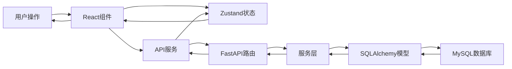

# 📁 项目结构说明

## 整体架构

```
web-system/
├── 📁 backend/                    # 后端服务 (FastAPI)
│   ├── 📁 app/                     # 应用核心代码
│   │   ├── 📁 api/                 # API路由模块
│   │   │   ├── admin.py           # 管理员API接口
│   │   │   ├── analytics.py       # 数据分析API
│   │   │   ├── audit.py           # 审计功能API
│   │   │   ├── auth.py            # 认证相关API
│   │   │   ├── export_admin.py    # 导出权限管理API
│   │   │   ├── invitation.py      # 邀请码管理API
│   │   │   ├── system_logs.py     # 系统日志API
│   │   │   └── token_usage.py     # Token使用统计API
│   │   ├── 📁 core/                # 核心配置和工具
│   │   │   ├── config.py          # 应用配置
│   │   │   ├── database.py        # 数据库连接
│   │   │   └── security.py        # 安全相关工具
│   │   ├── 📁 db/                  # 数据库相关
│   │   │   └── base.py            # 数据库基础配置
│   │   ├── 📁 models/              # 数据模型
│   │   │   ├── audit.py           # 审计任务模型
│   │   │   ├── export_permission.py # 导出权限模型
│   │   │   ├── invitation.py      # 邀请码模型
│   │   │   ├── system_log.py      # 系统日志模型
│   │   │   ├── token_usage.py     # Token使用模型
│   │   │   └── user.py            # 用户模型
│   │   ├── 📁 schemas/             # Pydantic数据验证
│   │   │   ├── audit.py           # 审计相关Schema
│   │   │   ├── auth.py            # 认证相关Schema
│   │   │   ├── export_permission.py # 导出权限Schema
│   │   │   ├── invitation.py      # 邀请码Schema
│   │   │   ├── system_log.py      # 系统日志Schema
│   │   │   ├── token_usage.py     # Token使用Schema
│   │   │   └── user.py            # 用户Schema
│   │   ├── 📁 services/            # 业务逻辑服务
│   │   │   ├── audit_service.py   # 审计核心服务
│   │   │   ├── auth_service.py    # 认证服务
│   │   │   ├── export_permission_service.py # 导出权限服务
│   │   │   ├── invitation_service.py # 邀请码服务
│   │   │   ├── system_log_service.py # 系统日志服务
│   │   │   └── token_usage_service.py # Token使用服务
│   │   ├── 📁 utils/               # 工具函数
│   │   │   ├── auth.py            # 认证工具
│   │   │   ├── dependencies.py    # FastAPI依赖
│   │   │   └── validators.py      # 数据验证工具
│   │   └── main.py                # FastAPI应用入口
│   ├── 📁 config/                  # 配置文件
│   │   └── examples/              # 配置示例
│   ├── 📁 venv/                    # Python虚拟环境
│   ├── requirements.txt           # Python依赖
│   ├── run_server.py              # 服务启动脚本
│   └── create_export_permission_tables.sql # 数据库表结构
├── 📁 frontend/                   # 前端应用 (React)
│   ├── 📁 public/                 # 静态资源
│   │   ├── favicon.ico           # 网站图标
│   │   ├── index.html            # HTML模板
│   │   └── manifest.json         # PWA配置
│   ├── 📁 src/                    # 源代码
│   │   ├── 📁 components/         # React组件
│   │   │   ├── 📁 Admin/          # 管理员组件
│   │   │   │   └── ExportPermissionManager.tsx # 导出权限管理
│   │   │   ├── 📁 Charts/         # 图表组件
│   │   │   │   ├── SecurityIssuesChart.tsx # 安全问题图表
│   │   │   │   ├── TokenUsageChart.tsx # Token使用图表
│   │   │   │   └── UserActivityChart.tsx # 用户活跃图表
│   │   │   ├── 📁 Layout/         # 布局组件
│   │   │   │   └── MainLayout.tsx # 主布局
│   │   │   ├── ExportButton.tsx   # 导出按钮组件
│   │   │   └── ProtectedRoute.tsx # 路由保护组件
│   │   ├── 📁 hooks/              # 自定义Hook
│   │   │   └── useRealTimeUpdates.ts # 实时更新Hook
│   │   ├── 📁 pages/              # 页面组件
│   │   │   ├── Admin.tsx          # 管理员页面
│   │   │   ├── Analytics.tsx      # 数据分析页面
│   │   │   ├── Audit.tsx          # 审计页面
│   │   │   ├── AuditResult.tsx    # 审计结果页面
│   │   │   ├── Dashboard.tsx      # 仪表板页面
│   │   │   ├── History.tsx        # 历史记录页面
│   │   │   ├── Login.tsx          # 登录页面
│   │   │   └── Profile.tsx        # 个人资料页面
│   │   ├── 📁 services/           # API服务
│   │   │   ├── analyticsService.ts # 数据分析服务
│   │   │   ├── api.ts             # API客户端
│   │   │   ├── auditService.ts    # 审计服务
│   │   │   ├── authService.ts     # 认证服务
│   │   │   ├── exportPermissionService.ts # 导出权限服务
│   │   │   └── invitationService.ts # 邀请码服务
│   │   ├── 📁 store/              # 状态管理
│   │   │   ├── auditStore.ts      # 审计状态
│   │   │   └── authStore.ts       # 认证状态
│   │   ├── 📁 types/              # TypeScript类型定义
│   │   │   └── index.ts           # 类型导出
│   │   ├── App.tsx                # 应用根组件
│   │   ├── App.css                # 应用样式
│   │   ├── index.tsx              # 应用入口
│   │   └── index.css              # 全局样式
│   ├── 📁 node_modules/           # npm依赖
│   ├── package.json               # npm配置
│   ├── package-lock.json          # npm锁定文件
│   └── tsconfig.json              # TypeScript配置
├── 📁 config/                     # 部署配置
│   ├── production.env             # 生产环境配置
│   └── examples/                  # 配置示例
├── 📁 scripts/                    # 部署脚本
│   └── generate-secrets.py       # 密钥生成脚本
├── docker-compose.yml             # Docker编排配置
├── docker-env-template            # Docker环境变量模板
├── deploy.sh                      # 部署脚本
├── DEPLOYMENT.md                  # 部署文档
├── PROJECT_STRUCTURE.md           # 项目结构说明
└── README.md                      # 项目说明文档
```

## 🔧 核心模块说明

### 后端模块 (Backend)

#### API层 (`app/api/`)
负责HTTP请求处理和响应，定义RESTful API接口

#### 服务层 (`app/services/`)
包含核心业务逻辑，处理复杂的业务规则和数据操作

#### 模型层 (`app/models/`)
定义SQLAlchemy ORM模型，对应数据库表结构

#### Schema层 (`app/schemas/`)
使用Pydantic定义数据验证和序列化规则

#### 工具层 (`app/utils/`)
提供通用工具函数和辅助功能

### 前端模块 (Frontend)

#### 组件层 (`src/components/`)
可复用的React组件，包括布局、图表、表单等

#### 页面层 (`src/pages/`)
对应不同路由的页面组件

#### 服务层 (`src/services/`)
封装API调用和数据处理逻辑

#### 状态管理 (`src/store/`)
使用Zustand管理全局应用状态

#### 类型定义 (`src/types/`)
TypeScript类型定义，确保类型安全

## 🗄 数据库结构

### 核心表
- `users` - 用户基础信息
- `audit_tasks` - 审计任务记录
- `audit_results` - 审计结果数据
- `audit_files` - 审计文件信息

### 扩展表
- `invitation_codes` - 邀请码管理
- `token_usage` - Token使用记录
- `user_export_permissions` - 用户导出权限
- `export_logs` - 导出操作日志
- `system_logs` - 系统操作日志

## 🚀 启动流程

### 开发环境
1. 后端: `python run_server.py` (端口8000)
2. 前端: `npm start` (端口3000)
3. 数据库: MySQL (端口3306)

### 生产环境
1. Docker构建: `docker-compose build`
2. 服务启动: `docker-compose up -d`
3. 反向代理: Nginx (端口80)

## 📦 依赖关系

### 后端依赖
- **FastAPI** - Web框架
- **SQLAlchemy** - ORM
- **Pydantic** - 数据验证
- **aiomysql** - 异步MySQL驱动
- **python-jose** - JWT处理
- **passlib** - 密码哈希

### 前端依赖
- **React** - UI框架
- **TypeScript** - 类型系统
- **Ant Design** - UI组件库
- **Zustand** - 状态管理
- **Axios** - HTTP客户端
- **React Router** - 路由管理

## 🔄 数据流



## 🛠 开发建议

### 代码组织
- 按功能模块分组，避免循环依赖
- 使用绝对导入路径
- 保持文件命名一致性

### 数据模型
- 使用明确的字段约束
- 添加适当的索引
- 考虑数据关系的完整性

### API设计
- 遵循RESTful原则
- 统一的错误处理
- 完善的输入验证

### 前端组件
- 保持组件单一职责
- 使用TypeScript增强类型安全
- 合理的状态管理层级

---

此文档将随项目发展持续更新，确保团队成员对项目结构有清晰的认识。
